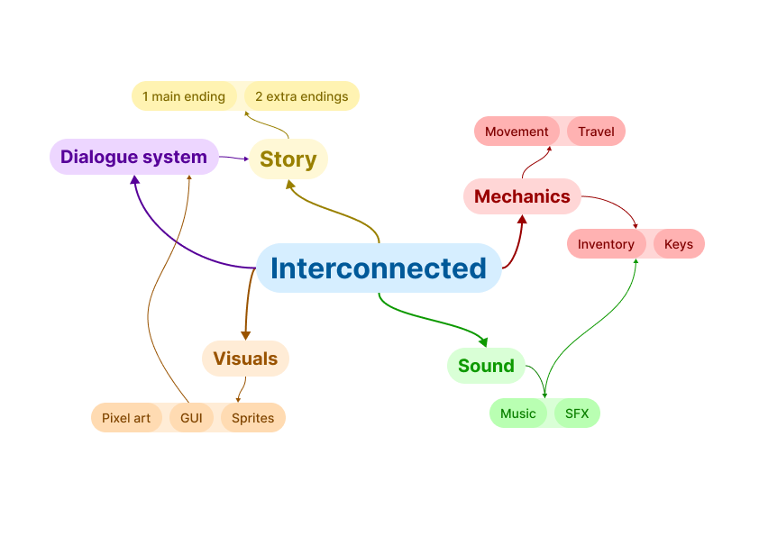
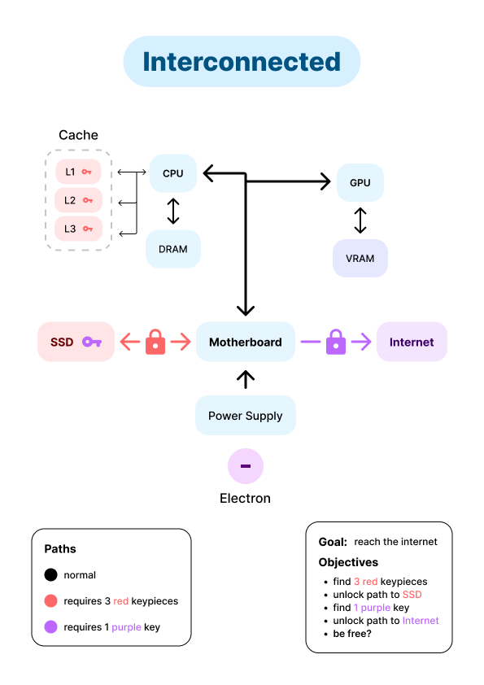

# Interconnected

### Interconnected is a story based adventure game designed and implemented with the python library [pygame](https://www.pygame.org/news)

Mindmap over the game design of ``Interconnected``

---

## Table of contents

<!-- - [Interconnected](#interconnected) -->
  <!-- - [Interconnected is a story based adventure game designed and implemented with the python library pygame](#interconnected-is-a-story-based-adventure-game-designed-and-implemented-with-the-python-library-pygame) -->
  <!-- - [Table of contents](#table-of-contents) -->
  - [Installation & setup](#installation--setup)
  - [Game description & objective](#game-description--objective)
  - [Controls](#controls)
      - [Basic controls](#basic-controls)
      - [Dialogue](#dialogue)
      - [Game](#game)
  - [Assets](#assets)
  - [Notes](#notes)

---

## Installation & setup

TBD

1. Begin with installing the python package ``pygame``

        pip install pygame
2. Run the game from 
  

## Game description & objective
 *about where things begin, and where things are able to go*  

## Controls

#### Basic controls

``WASD`` - movement  
``E`` - interact  
``Q`` - inventory  

#### Dialogue

``Spacebar`` - skip dialogue  

#### Game

``P`` - pause  
``H`` - help  

## Assets

**Game design**   Petrus Matiros

**Concept, story and writing**   Petrus Matiros

**Visual UI elements**   Petrus Matiros

**GUI ([Pixel Art GUI Elements](https://mounirtohami.itch.io/pixel-art-gui-elements))**   Mounir Tohami

**Pixel art ([Libresprite](https://libresprite.github.io/))**   Petrus Matiros

**Background splash art ([Space background generator](https://deep-fold.itch.io/space-background-generator))**   Deep-Fold

**SFX ([jsfxr](https://sfxr.me/) and [Chiptone](https://sfbgames.itch.io/chiptone))**   Petrus Matiros

**Background ambience ([noises.online](https://noises.online/))**   Petrus Matiros

**Background music ([Space Music Pack](https://gooseninja.itch.io/space-music-pack))**   Goose Ninja

**Asset pack, SFX ([Space Ultimate Megapack](https://gamesupply.itch.io/ultimate-space-game-mega-asset-package))**   GameSupplyGuy

**Font 01 ([Humble Fonts Free](https://somepx.itch.io/humble-fonts-free))**   Eeve Somepx

**Font 02 ([monogram](https://datagoblin.itch.io/monogram))**   datagoblin

**Font 03 ([Abaddon](https://caffinate.itch.io/abaddon))**   Nathan Scott

**Font 04 ([managore](https://managore.itch.io/m5x7))**   daniel linssen

## Notes

This game was developed as a revised version of a previously private project. The inception of the game was procured by being enlisted in a university programming course (Course code: DD1349) at KTH Royal Institute of Technology, in Sweden.
